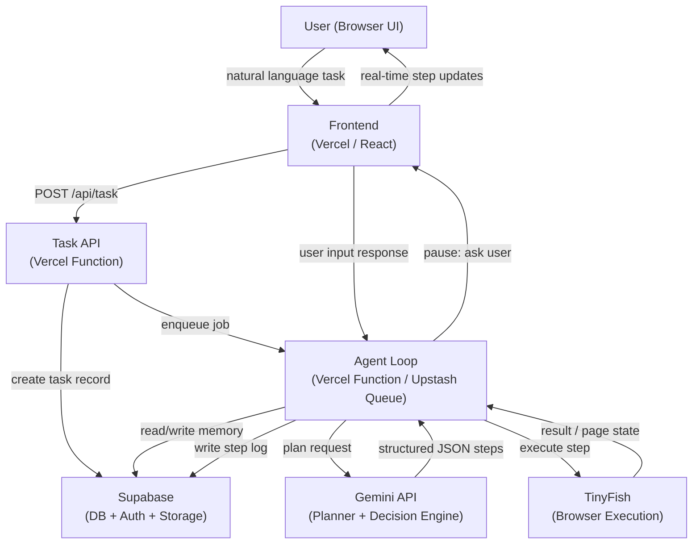
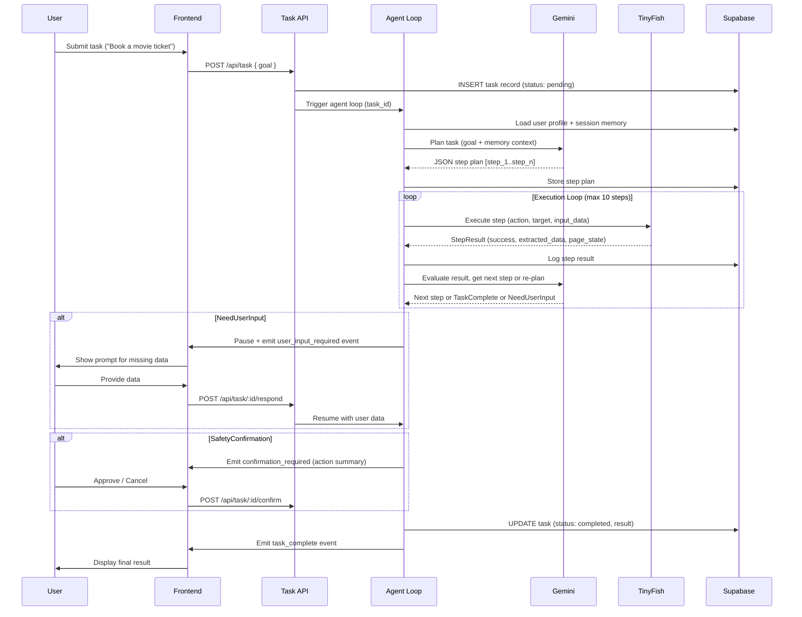
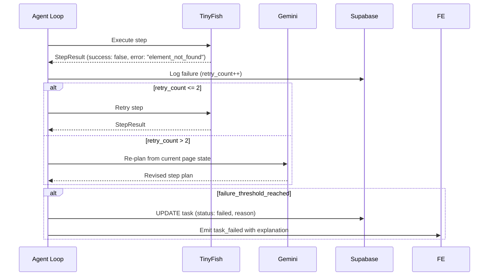

# Design Document: Autonomous Web Agent

## Overview

A domain-agnostic autonomous AI agent MVP that executes real-world web tasks from natural language input. The system behaves like a cautious digital worker: it accepts a plain-English goal, uses Gemini to plan and reason, executes browser actions via TinyFish, persists state in Supabase, and surfaces live progress through a Vercel-hosted React frontend. The agent asks for missing data, requires confirmation before sensitive actions, and handles real-world failures gracefully through a structured retry and re-plan loop.

The MVP is scoped to single tasks, max 10 steps, no parallel agents, and basic retry (1–2 times). Success criteria: book a movie ticket, compare products and select best, fill and submit a basic form with user input.

## Architecture



## Sequence Diagrams

### Main Happy Path



### Error and Re-plan Flow



## Components and Interfaces

### 1. Task API (Vercel Function)

**Purpose**: Entry point for task submission and user interaction responses.

**Interface**:
```typescript
// POST /api/task
interface CreateTaskRequest {
  goal: string           // plain English task description
  user_id: string
}
interface CreateTaskResponse {
  task_id: string
  status: "pending"
}

// POST /api/task/:id/respond
interface UserResponseRequest {
  task_id: string
  fields: Record<string, string>  // user-provided field values
}

// POST /api/task/:id/confirm
interface UserConfirmRequest {
  task_id: string
  confirmed: boolean
}

// GET /api/task/:id/status
interface TaskStatusResponse {
  task_id: string
  status: TaskStatus
  steps: StepLog[]
  result?: TaskResult
  pending_input?: UserInputRequest
}
```

**Responsibilities**:
- Validate and persist incoming task
- Trigger agent loop execution
- Route user responses back to paused agent loop
- Stream or poll step logs to frontend

---

### 2. Agent Loop (Vercel Function / Upstash Worker)

**Purpose**: Orchestrates the plan → execute → evaluate cycle.

**Interface**:
```typescript
interface AgentLoopInput {
  task_id: string
  goal: string
  user_id: string
}

interface AgentLoopOutput {
  status: "completed" | "failed" | "paused"
  result?: TaskResult
  failure_reason?: string
}
```

**Responsibilities**:
- Load memory context from Supabase
- Call Gemini planner to generate step plan
- Execute steps sequentially via TinyFish adapter
- Handle retries and re-planning
- Emit pause events for user input or safety confirmation
- Write all step logs to Supabase

---

### 3. Gemini Adapter (Planner + Decision Engine)

**Purpose**: Wraps Gemini API calls for planning, evaluation, and decision-making.

**Interface**:
```typescript
interface PlanRequest {
  goal: string
  memory_context: MemoryContext
  max_steps: number  // default: 10
}

interface PlanResponse {
  steps: AgentStep[]
  reasoning: string
}

interface EvaluateRequest {
  step: AgentStep
  result: StepResult
  remaining_steps: AgentStep[]
  retry_count: number
}

interface EvaluateResponse {
  decision: "continue" | "retry" | "replan" | "need_user_input" | "complete" | "fail"
  revised_steps?: AgentStep[]
  user_input_request?: UserInputRequest
  reasoning: string
}

interface DecideRequest {
  options: ExtractedOption[]
  criteria: string
}

interface DecideResponse {
  selected: ExtractedOption
  reasoning: string
}
```

---

### 4. TinyFish Adapter (Browser Execution)

**Purpose**: Wraps TinyFish browser automation API.

**Interface**:
```typescript
interface ExecuteStepRequest {
  session_id: string
  step: AgentStep
}

interface StepResult {
  success: boolean
  extracted_data?: Record<string, unknown>
  error?: BrowserError
  page_state: PageState
}

interface PageState {
  url: string
  title: string
  forms_detected: FormSchema[]
  screenshot_url?: string
}

interface BrowserError {
  type: "element_not_found" | "timeout" | "login_required" | "captcha" | "navigation_failed"
  message: string
}
```

---

### 5. Memory Service (Supabase)

**Purpose**: Persist and retrieve user profile, session state, step history.

**Interface**:
```typescript
interface MemoryContext {
  user_profile: UserProfile
  session_state: SessionState
  extracted_data: Record<string, unknown>
  step_history: StepLog[]
}

interface UserProfile {
  user_id: string
  name?: string
  email?: string
  phone?: string
  preferences?: Record<string, string>
  // NOTE: payment/identity data stored encrypted, never auto-filled
}

interface SessionState {
  task_id: string
  current_step_index: number
  retry_counts: Record<string, number>
  browser_session_id?: string
}
```

---

### 6. Form Handler

**Purpose**: Detect forms, match fields to memory, identify missing data.

**Interface**:
```typescript
interface FormSchema {
  fields: FormField[]
}

interface FormField {
  label: string
  name: string
  type: "text" | "email" | "tel" | "date" | "select" | "file" | "password"
  required: boolean
  options?: string[]  // for select fields
}

interface FormFillPlan {
  auto_fill: Record<string, string>   // fields matched from memory
  needs_user_input: FormField[]       // fields requiring user input
  requires_confirmation: FormField[]  // sensitive fields (payment, identity)
}
```

---

### 7. Frontend (Vercel / React)

**Purpose**: Display live execution, collect user input, show results.

**Interface** (component contracts):
```typescript
interface TaskInputProps {
  onSubmit: (goal: string) => void
}

interface ExecutionViewProps {
  task_id: string
  steps: StepLog[]
  status: TaskStatus
  pending_input?: UserInputRequest
  onUserResponse: (fields: Record<string, string>) => void
  onConfirm: (confirmed: boolean) => void
}

interface StepLogItemProps {
  step: StepLog
}
```

## Data Models

### AgentStep

```typescript
interface AgentStep {
  step_id: string                    // e.g. "step_1"
  action_type: ActionType
  target: string                     // URL, CSS selector, keyword, or element description
  input_data?: Record<string, string>
  expected_output: string
  fallback_strategy: string
}

type ActionType =
  | "search"
  | "open"
  | "click"
  | "input"
  | "extract"
  | "select"
  | "submit"
  | "scroll"
  | "upload"
  | "wait"
```

### TaskRecord (Supabase: `tasks` table)

```typescript
interface TaskRecord {
  id: string                  // uuid
  user_id: string
  goal: string
  status: TaskStatus
  step_plan: AgentStep[]
  result?: TaskResult
  failure_reason?: string
  created_at: string
  updated_at: string
}

type TaskStatus = "pending" | "running" | "paused" | "completed" | "failed"
```

### StepLog (Supabase: `step_logs` table)

```typescript
interface StepLog {
  id: string
  task_id: string
  step_id: string
  action_type: ActionType
  target: string
  status: "pending" | "running" | "success" | "failed" | "skipped"
  result?: StepResult
  retry_count: number
  timestamp: string
}
```

### TaskResult

```typescript
interface TaskResult {
  summary: string
  extracted_data: Record<string, unknown>
  confirmation_log: ConfirmationEntry[]
}

interface ConfirmationEntry {
  action: string
  confirmed_by_user: boolean
  timestamp: string
}
```

### UserInputRequest

```typescript
interface UserInputRequest {
  task_id: string
  type: "missing_fields" | "safety_confirmation" | "captcha" | "credentials"
  message: string
  fields?: FormField[]
  action_summary?: string  // for safety confirmation
}
```

## Algorithmic Pseudocode

### Main Agent Loop

```pascal
ALGORITHM runAgentLoop(task_id, goal, user_id)
INPUT: task_id: String, goal: String, user_id: String
OUTPUT: AgentLoopOutput

BEGIN
  ASSERT goal IS NOT EMPTY
  ASSERT user_id IS NOT EMPTY

  memory ← loadMemoryContext(user_id, task_id)
  plan ← gemini.plan(goal, memory, max_steps=10)

  ASSERT plan.steps IS NOT EMPTY
  ASSERT LENGTH(plan.steps) <= 10

  updateTaskStatus(task_id, "running")
  retry_counts ← {}
  step_index ← 0

  WHILE step_index < LENGTH(plan.steps) DO
    ASSERT step_index >= 0
    ASSERT ALL previous steps logged in Supabase

    step ← plan.steps[step_index]
    logStep(task_id, step, "running")

    IF requiresSafetyConfirmation(step) THEN
      confirmed ← awaitUserConfirmation(task_id, step)
      IF NOT confirmed THEN
        updateTaskStatus(task_id, "failed", "User cancelled at safety check")
        RETURN { status: "failed", failure_reason: "user_cancelled" }
      END IF
    END IF

    result ← tinyfish.executeStep(session_id, step)
    logStep(task_id, step, result)

    evaluation ← gemini.evaluate(step, result, plan.steps[step_index+1..], retry_counts[step.step_id])

    IF evaluation.decision = "continue" THEN
      step_index ← step_index + 1

    ELSE IF evaluation.decision = "retry" THEN
      retry_counts[step.step_id] ← retry_counts[step.step_id] + 1
      IF retry_counts[step.step_id] > 2 THEN
        evaluation.decision ← "replan"
      END IF

    ELSE IF evaluation.decision = "replan" THEN
      plan ← gemini.plan(goal, loadMemoryContext(user_id, task_id), max_steps=10)
      step_index ← 0
      retry_counts ← {}

    ELSE IF evaluation.decision = "need_user_input" THEN
      user_data ← awaitUserInput(task_id, evaluation.user_input_request)
      storeUserData(user_id, user_data)
      // do not advance step_index; retry with new data

    ELSE IF evaluation.decision = "complete" THEN
      result ← buildTaskResult(task_id)
      updateTaskStatus(task_id, "completed", result)
      RETURN { status: "completed", result: result }

    ELSE IF evaluation.decision = "fail" THEN
      updateTaskStatus(task_id, "failed", evaluation.reasoning)
      RETURN { status: "failed", failure_reason: evaluation.reasoning }

    END IF
  END WHILE

  result ← buildTaskResult(task_id)
  updateTaskStatus(task_id, "completed", result)
  RETURN { status: "completed", result: result }
END
```

**Preconditions:**
- `goal` is a non-empty string
- `user_id` references a valid authenticated user
- Gemini API and TinyFish are reachable
- Supabase connection is available

**Postconditions:**
- Task record in Supabase reflects final status
- All executed steps are logged
- If completed: `result` contains summary and extracted data
- If failed: `failure_reason` is set with human-readable explanation

**Loop Invariants:**
- `step_index` is always a valid index into `plan.steps` or equals `LENGTH(plan.steps)`
- All steps at indices `[0, step_index)` have a corresponding log entry
- `retry_counts[step_id]` never exceeds 3 before triggering replan

---

### Gemini Planner

```pascal
ALGORITHM planTask(goal, memory_context, max_steps)
INPUT: goal: String, memory_context: MemoryContext, max_steps: Integer
OUTPUT: PlanResponse

BEGIN
  ASSERT max_steps >= 1 AND max_steps <= 10

  prompt ← buildPlannerPrompt(goal, memory_context)
  raw_response ← gemini.generateContent(prompt)
  steps ← parseStepJSON(raw_response)

  ASSERT LENGTH(steps) >= 1
  ASSERT LENGTH(steps) <= max_steps

  FOR EACH step IN steps DO
    ASSERT step.step_id IS NOT EMPTY
    ASSERT step.action_type IN VALID_ACTION_TYPES
    ASSERT step.target IS NOT EMPTY
    ASSERT step.expected_output IS NOT EMPTY
    ASSERT step.fallback_strategy IS NOT EMPTY
  END FOR

  RETURN { steps: steps, reasoning: raw_response.reasoning }
END
```

**Preconditions:**
- `goal` is non-empty
- `max_steps` is between 1 and 10 inclusive
- Gemini API key is configured

**Postconditions:**
- Returns 1–10 valid AgentStep objects
- Each step has all required fields populated
- Steps are ordered logically to achieve the goal

---

### Form Handler

```pascal
ALGORITHM buildFormFillPlan(form_schema, memory_context)
INPUT: form_schema: FormSchema, memory_context: MemoryContext
OUTPUT: FormFillPlan

BEGIN
  auto_fill ← {}
  needs_user_input ← []
  requires_confirmation ← []

  FOR EACH field IN form_schema.fields DO
    IF isSensitiveField(field) THEN
      requires_confirmation.append(field)

    ELSE IF memory_context.user_profile HAS field.name THEN
      auto_fill[field.name] ← memory_context.user_profile[field.name]

    ELSE IF memory_context.extracted_data HAS field.name THEN
      auto_fill[field.name] ← memory_context.extracted_data[field.name]

    ELSE IF field.required THEN
      needs_user_input.append(field)

    END IF
  END FOR

  RETURN {
    auto_fill: auto_fill,
    needs_user_input: needs_user_input,
    requires_confirmation: requires_confirmation
  }
END

FUNCTION isSensitiveField(field)
  sensitive_types ← ["password", "credit_card", "ssn", "identity"]
  sensitive_labels ← ["card number", "cvv", "social security", "passport", "payment"]
  RETURN field.type = "password"
    OR ANY label IN sensitive_labels WHERE label IN LOWERCASE(field.label)
END
```

**Preconditions:**
- `form_schema.fields` is a non-empty list
- `memory_context` is loaded from Supabase

**Postconditions:**
- Every field in `form_schema.fields` appears in exactly one of: `auto_fill`, `needs_user_input`, or `requires_confirmation`
- No sensitive field is placed in `auto_fill` without explicit user confirmation
- `needs_user_input` contains only required fields that have no memory match

---

### Error Handler

```pascal
ALGORITHM handleStepError(step, error, retry_count, task_id)
INPUT: step: AgentStep, error: BrowserError, retry_count: Integer, task_id: String
OUTPUT: ErrorHandlingDecision

BEGIN
  IF error.type = "element_not_found" OR error.type = "navigation_failed" THEN
    IF retry_count < 2 THEN
      RETURN { action: "retry", delay_ms: 1000 }
    ELSE
      RETURN { action: "replan" }
    END IF

  ELSE IF error.type = "login_required" THEN
    RETURN {
      action: "need_user_input",
      request: { type: "credentials", message: "Login required for this site" }
    }

  ELSE IF error.type = "captcha" THEN
    RETURN {
      action: "need_user_input",
      request: { type: "captcha", message: "CAPTCHA detected — please solve manually" }
    }

  ELSE IF error.type = "timeout" THEN
    IF retry_count < 2 THEN
      RETURN { action: "retry", delay_ms: 3000 }
    ELSE
      RETURN { action: "fail", reason: "Step timed out after retries: " + step.step_id }
    END IF

  ELSE
    RETURN { action: "fail", reason: "Unrecoverable error: " + error.message }
  END IF
END
```

**Preconditions:**
- `error.type` is one of the defined BrowserError types
- `retry_count` >= 0

**Postconditions:**
- Returns exactly one ErrorHandlingDecision
- `retry` decisions always include a `delay_ms` value
- `fail` decisions always include a human-readable `reason`

## Key Functions with Formal Specifications

### `requiresSafetyConfirmation(step)`

```typescript
function requiresSafetyConfirmation(step: AgentStep): boolean
```

**Preconditions:**
- `step` is a valid AgentStep with `action_type` set

**Postconditions:**
- Returns `true` if and only if the step involves payment, form submission, email sending, or file upload
- Never returns `true` for read-only actions (search, open, extract, scroll)
- No side effects

---

### `loadMemoryContext(user_id, task_id)`

```typescript
async function loadMemoryContext(user_id: string, task_id: string): Promise<MemoryContext>
```

**Preconditions:**
- `user_id` is a valid authenticated user ID
- `task_id` exists in the `tasks` table

**Postconditions:**
- Returns MemoryContext with user_profile, session_state, extracted_data, step_history
- If no prior session exists, returns empty/default values (never throws)
- Sensitive fields (payment, identity) are excluded from returned profile

---

### `awaitUserInput(task_id, request)`

```typescript
async function awaitUserInput(task_id: string, request: UserInputRequest): Promise<Record<string, string>>
```

**Preconditions:**
- `task_id` references a running task
- `request.fields` is non-empty when `request.type === "missing_fields"`

**Postconditions:**
- Task status set to "paused" while waiting
- Returns user-provided field values after response received
- Task status restored to "running" after response
- Throws `UserCancelledError` if user cancels

---

### `buildPlannerPrompt(goal, memory_context)`

```typescript
function buildPlannerPrompt(goal: string, memory_context: MemoryContext): string
```

**Preconditions:**
- `goal` is non-empty

**Postconditions:**
- Returns a prompt string that includes: goal, available user profile fields (non-sensitive), prior step history summary, instruction to output valid JSON matching AgentStep schema
- Never includes raw passwords or payment data in prompt

## Example Usage

```typescript
// 1. User submits task via frontend
const response = await fetch("/api/task", {
  method: "POST",
  body: JSON.stringify({ goal: "Book a movie ticket for Inception tonight", user_id: "usr_123" })
})
const { task_id } = await response.json()

// 2. Frontend polls or subscribes to task status
const status = await fetch(`/api/task/${task_id}/status`).then(r => r.json())
// status.steps shows live execution log
// status.pending_input shows if user input is needed

// 3. User provides missing data when prompted
if (status.pending_input?.type === "missing_fields") {
  await fetch(`/api/task/${task_id}/respond`, {
    method: "POST",
    body: JSON.stringify({ fields: { phone: "[phone_number]", seat_preference: "aisle" } })
  })
}

// 4. User confirms safety-gated action
if (status.pending_input?.type === "safety_confirmation") {
  await fetch(`/api/task/${task_id}/confirm`, {
    method: "POST",
    body: JSON.stringify({ confirmed: true })
  })
}

// 5. Task completes
// status.result.summary = "Successfully booked 1 ticket for Inception at 8:00 PM"
// status.result.extracted_data = { booking_ref: "BK-9921", seat: "D4" }
```

## Correctness Properties

*A property is a characteristic or behavior that should hold true across all valid executions of a system — essentially, a formal statement about what the system should do. Properties serve as the bridge between human-readable specifications and machine-verifiable correctness guarantees.*

### Property 1: Completed tasks have fully logged steps

*For any* task with status "completed", every step in the step_plan has a corresponding StepLog entry with status not equal to "pending".

**Validates: Requirements 3.2, 3.3, 10.4**

### Property 2: Form field partition completeness

*For any* FormSchema and MemoryContext, the FormFillPlan produced by buildFormFillPlan must place every field in exactly one of: auto_fill, needs_user_input, or requires_confirmation — the sets are disjoint and their union equals all fields.

**Validates: Requirements 8.1, 8.2, 8.3, 8.4**

### Property 3: Sensitive fields never auto-filled without confirmation

*For any* form field where isSensitiveField returns true, that field must never appear in auto_fill unless a ConfirmationEntry with confirmed_by_user true exists for the action.

**Validates: Requirements 8.5, 7.5, 11.4**

### Property 4: Retry count invariant

*For any* step execution sequence, retry_count for any given step_id never exceeds 3 before a re-plan is triggered; exceeding 2 retries always causes a replan decision before a third attempt.

**Validates: Requirements 5.3, 5.4**

### Property 5: Plan step count bounds

*For any* valid goal string passed to the Gemini Planner, the returned plan always contains between 1 and 10 AgentStep objects inclusive.

**Validates: Requirements 2.1, 3.5**

### Property 6: Safety-gated steps require prior confirmation

*For any* step where requiresSafetyConfirmation returns true, the Agent_Loop must pause and record a ConfirmationEntry with confirmed_by_user true before the step executes.

**Validates: Requirements 7.1, 7.5**

### Property 7: Failed tasks always have a non-empty failure_reason

*For any* task with status "failed", the failure_reason field is a non-empty human-readable string.

**Validates: Requirements 10.5, 12.4**

### Property 8: Planner prompt never contains sensitive data

*For any* MemoryContext containing sensitive fields (passwords, payment data), the prompt string produced by buildPlannerPrompt must not contain those raw sensitive values.

**Validates: Requirements 11.3**

### Property 9: handleStepError always returns a valid decision

*For any* BrowserError type and retry_count value, handleStepError returns exactly one ErrorHandlingDecision with all required fields populated (retry decisions include delay_ms, fail decisions include reason).

**Validates: Requirements 5.1, 5.2, 12.1, 12.3**

### Property 10: Read-only actions never require safety confirmation

*For any* AgentStep with action_type in {search, open, extract, scroll}, requiresSafetyConfirmation returns false.

**Validates: Requirements 7.6**

## Error Handling

### Element Not Found / Layout Changed
**Condition**: TinyFish cannot locate the target element on the page.
**Response**: Retry the step once with a 1-second delay. If retry fails, trigger Gemini re-plan with current page state as context.
**Recovery**: Re-planned steps use updated selectors or alternative navigation paths.

### Login Required
**Condition**: TinyFish detects a login wall or redirect to auth page.
**Response**: Pause execution, emit `need_user_input` event with `type: "credentials"`. Never store raw passwords in logs.
**Recovery**: Resume execution after user provides credentials; store session cookie in Supabase session state.

### CAPTCHA Detected
**Condition**: TinyFish detects a CAPTCHA challenge.
**Response**: Pause execution, notify user to solve manually via frontend.
**Recovery**: Resume after user signals completion.

### Timeout
**Condition**: TinyFish step exceeds time limit.
**Response**: Retry with 3-second delay (max 2 retries). If still failing, mark step as failed.
**Recovery**: Agent loop marks task as failed with explanation; suggests user retry later.

### Gemini Parse Error
**Condition**: Gemini response cannot be parsed as valid AgentStep JSON.
**Response**: Retry plan request once with a more constrained prompt. If still invalid, fail task.
**Recovery**: Task fails with `failure_reason: "planner_error"`.

### User Cancellation
**Condition**: User cancels at a safety confirmation prompt.
**Response**: Immediately stop execution, mark task as `failed` with `failure_reason: "user_cancelled"`.
**Recovery**: No further browser actions taken; session cleaned up.

## Testing Strategy

### Unit Testing Approach

Test each adapter and algorithm in isolation with mocked dependencies:
- `buildFormFillPlan`: property-based tests over arbitrary form schemas and memory contexts
- `handleStepError`: exhaustive tests over all `BrowserError.type` values and retry counts
- `requiresSafetyConfirmation`: table-driven tests over all `ActionType` values
- `buildPlannerPrompt`: assert sensitive data never appears in output
- `parseStepJSON`: fuzz with malformed Gemini responses

### Property-Based Testing Approach

**Property Test Library**: fast-check

Key properties to test:
- `buildFormFillPlan` partitions all fields: `auto_fill ∪ needs_user_input ∪ requires_confirmation = all fields` and sets are disjoint
- `handleStepError` always returns a valid `ErrorHandlingDecision` for any `BrowserError`
- Agent loop retry invariant: `retry_counts[step_id]` never exceeds 3 for any step
- Planner output: for any valid goal string, parsed steps always satisfy `1 <= length <= 10`

### Integration Testing Approach

- End-to-end task flow with a mock TinyFish and mock Gemini: submit task → plan → execute 3 steps → complete
- User input pause/resume: verify task pauses correctly and resumes with provided data
- Safety confirmation gate: verify step does not execute until `confirmed === true`
- Supabase integration: verify step logs are written atomically and task status transitions are correct

## Performance Considerations

- Vercel Functions have a 10-second default timeout; the agent loop must use Upstash Queue for tasks that may exceed this (background job pattern)
- TinyFish browser sessions should be reused within a task to avoid cold-start overhead
- Gemini API calls are the primary latency source; plan and evaluate calls should be parallelized where safe (e.g., pre-fetching next step evaluation)
- Supabase real-time subscriptions used for frontend step log streaming to avoid polling overhead
- MVP: single task at a time per user; no concurrency concerns at this scale

## Security Considerations

- All API routes require authenticated user session (Supabase Auth JWT)
- Sensitive user data (payment, identity) stored encrypted at rest in Supabase; never included in Gemini prompts or TinyFish step inputs without explicit user confirmation
- Browser session credentials (cookies, tokens) stored in Supabase with row-level security scoped to `user_id`
- All actions logged with timestamps and `user_id` for audit trail
- Safety confirmation required before: form submissions, payments, email sends, file uploads
- CAPTCHA handling never automated; always requires human intervention
- Rate limiting on `/api/task` to prevent abuse

## Dependencies

| Dependency | Purpose | Notes |
|---|---|---|
| Gemini API | Task planning, step evaluation, decision-making | Requires API key; use `gemini-1.5-flash` for MVP |
| TinyFish | Browser automation execution | Managed browser sessions |
| Vercel | Frontend hosting + serverless API functions | Use Edge Functions for low-latency status checks |
| Supabase | PostgreSQL DB, Auth, Storage, Realtime | Row-level security required |
| Upstash (optional) | Background job queue for long-running tasks | Use if agent loop exceeds Vercel function timeout |
| React | Frontend UI | Minimal; no heavy framework needed |
| fast-check | Property-based testing | For invariant verification |
